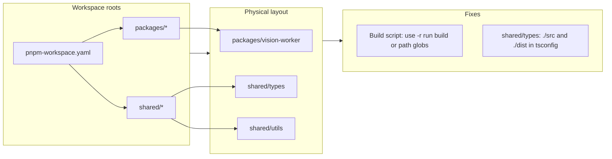

# Workspace Topology Alignment Plan

## Current state (from read-only checks)

- **Workspace roots**: [pnpm-workspace.yaml](pnpm-workspace.yaml) defines `packages/`_ and `shared/`_. The file tree has `packages/vision-worker`, `shared/types`, and `shared/utils`, so these patterns match the physical layout.
- **Package names**: [packages/vision-worker/package.json](packages/vision-worker/package.json) correctly uses `"name": "@asymmetric-legal/vision-worker"`. [shared/types](shared/types/package.json) and [shared/utils](shared/utils/package.json) use `@asymmetric-legal/types` and `@asymmetric-legal/utils`.
- **Root build script**: [package.json](package.json) uses:
  - `"build": "pnpm -r --filter ./packages... --filter ./shared... run build"`
    In pnpm, `--filter ./path...` means “the package at `./path` and its dependencies.” There is no package at `./packages` or `./shared`; packages live at `./packages/vision-worker`, `./shared/types`, and `./shared/utils`. So **no workspace package matches** these filters, which causes “No projects matched.”
- **shared/types tsconfig**: [shared/types/tsconfig.json](shared/types/tsconfig.json) has `include: ["src"]` and `outDir: "dist"` (and `rootDir: "src"`). These are valid relative to that file and resolve to `shared/types/src` and `shared/types/dist`. Red state is often from the IDE resolving from the wrong base (e.g. base config’s `baseUrl`/paths) or from ambiguous relative paths; making paths explicitly relative to the config folder removes that ambiguity.

---

## 1. Verify workspace roots (no change needed)

- [pnpm-workspace.yaml](pnpm-workspace.yaml): `packages/`_ and `shared/`_ already match the real folders (`packages/vision-worker`, `shared/types`, `shared/utils`).
- No edits required; only a quick visual check during execution.

---

## 2. Fix root build script filter (fix “No projects matched”)

**Cause**: Filters `./packages...` and `./shared...` select a package at that exact path; there is no package at `./packages` or `./shared`.

**Options** (pick one):

- **A (recommended – inclusive recursive build)**: Run build in all workspace packages with no filter:

```json
  "build": "pnpm -r run build"


```

- **B (keep scoped build)**: Use path globs so packages under those dirs match:

```json
  "build": "pnpm -r --filter \"./packages/**\" --filter \"./shared/**\" run build"


```

Either removes the “No projects matched” error; A matches your “more inclusive filter” and is simpler.

---

## 3. Fix TSConfig “red state” in shared/types

In [shared/types/tsconfig.json](shared/types/tsconfig.json):

- Make `include` and output dir explicitly relative to the config file so the IDE and `tsc` resolve from `shared/types/` only:
  - Set `include` to `["./src"]` (or `["src"]` if you prefer; `./src` is more explicit).
  - Set `compilerOptions.outDir` to `"./dist"` (and optionally `rootDir` to `"./src"` for consistency).

This keeps behavior the same but avoids ambiguity that can cause red state when the base config is applied.

**Concrete change**:

```json
{
  "extends": "../../tsconfig.base.json",
  "compilerOptions": {
    "rootDir": "./src",
    "outDir": "./dist",
    "composite": true
  },
  "include": ["./src"]
}
```

---

## 4. Sync pnpm and run build

- Run from repo root: `pnpm install`.
- Then run: `pnpm -r run build`.

---

## 5. Success criteria

- `pnpm -r run build` completes without “No projects matched.”
- No red status on [shared/types/tsconfig.json](shared/types/tsconfig.json) in the IDE (reopen the file or reload window if needed).

---

## Summary diagram



---

## Execution order

1. Update root [package.json](package.json) build script (choose A or B above).
2. Update [shared/types/tsconfig.json](shared/types/tsconfig.json) with explicit `./src` and `./dist`.
3. Run `pnpm install`.
4. Run `pnpm -r run build` and confirm success and that tsconfig red state is gone.
