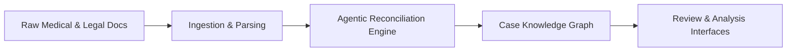

## Asymmetric Legal Intelligence System

The **Asymmetric Legal Intelligence System** turns messy medical records, facility charts, and legal artefacts into structured, auditable case intelligence for nursing home negligence matters. Instead of paralegals and associates manually reconciling thousands of pages by hand, the system uses **agentic, auditable workflows** to reconcile what *should* have happened with what *actually* occurred.

Where traditional review is slow, error‑prone, and expensive, Asymmetric focuses on:

- **Agentic reconciliation**: domain-tuned workers ingest PDFs, images, and structured feeds, then reconcile them into typed entities and timelines.
- **Auditability-first modeling**: every extracted datum is anchored to `(BatesNumber, BoundingBox { x, y, w, h, pageNumber })` so you can always answer “where did this come from?”.
- **Kubernetes-native scale**: microservices and workers are designed for horizontal scale and future autoscaling in K8s.

### Architecture at a glance

At a high level, the system looks like this:



- **Ingestion & parsing**: Vision and parsing workers turn PDFs/images into structured text and regions keyed by Bates numbers.
- **Agentic reconciliation engine**: Orchestrated agents align clinical events, orders, and charting with regulatory and care-plan expectations.
- **Case knowledge graph**: Strongly-typed entities, relationships, and variances live in a queryable store.
- **Interfaces**: Future UIs/CLIs sit on top of the graph to support review, QC, and expert workflows.

## Quick start

### Prerequisites

- **Node.js**: `>=22` (ESM only)
- **Package manager**: `pnpm` with workspaces (via `corepack`)

### Install dependencies

```bash
corepack enable
pnpm install
```

### Build the monorepo

```bash
pnpm build
```

### Run tests

```bash
pnpm test
```

## Repository layout

- `packages/` – Microservices and workers that implement the agentic pipeline
  - `vision-worker/` – Vision worker pods that transform Bates-stamped documents into regions and signals, tuned for HPA.
  - `agent-orchestrator/` – Orchestrates multi-agent workflows for reconciliation and variance detection.
  - `data-api/` – API layer for exposing case data and reconciled insights.
- `shared/` – Shared libraries used across all services
  - `types/` – Canonical domain types (e.g., branded IDs, Bates mappings, bounding boxes) enforcing auditability.
  - `utils/` – Cross-cutting utilities (structured logging with case/Bates context, backoff, resilience helpers).
- `infra/` – Deployment artefacts
  - `helm/charts/` – Helm charts per service for Kubernetes deployment.
  - `docker/` – Shared Docker/deployment helpers.

## Platform and tooling

- **Runtime**: Node.js `>=22` (ESM only).
- **Language**: TypeScript with strict settings shared via `tsconfig.base.json` (zero `any` by design).
- **Workspaces**: `pnpm` workspaces managing `packages/*` and `shared/*`.

Root scripts:

- `pnpm build` – Recursively builds all workspaces.
- `pnpm test` – Runs tests across workspaces.
- `pnpm lint` – Lints all packages.
- `pnpm typecheck` – Runs TypeScript type-checking.

## Secrets, PHI, and data safety

This system is intended to operate on sensitive legal and medical data. The public repository must **never** contain real PHI, client identifiers, or live secrets.

### Secrets and configuration

- Use `.env.example` at the repo root as a template.
- Create a local `.env` file for development and keep it untracked (see `.gitignore`).
- Helm charts include `values-secrets.example.yaml` and `secrets.yaml` stubs; copy and fill them **outside of version control** for real deployments.

### Data safety checklist

When adding examples, tests, or documentation:

- **Do not** include real patient names, MRNs, claim IDs, or dates of birth.
- **Do not** include real law firm/client names, docket numbers, or actual Bates ranges.
- Use synthetic placeholders such as `PATIENT_001`, `FACILITY_ABC`, `CASE_0001`, and `BATES_000001–000010`.
- Keep all sample data obviously fictitious and de‑identified.

This same guidance applies to Cursor plans and other local tooling outputs—plans should only reference synthetic, non-identifying examples.

## Kubernetes and Helm

- Each service has its own Helm chart under `infra/helm/charts/<service-name>/`.
- Charts are structured for:
  - Deployments and Services
  - Future HPAs tuned for vision workloads
  - Configuration and secret wiring for data stores and cloud resources (e.g., Supabase, Azure)

## Auditability and data model

All data extraction is modeled to map back to:

```text
(BatesNumber, BoundingBox { x, y, w, h, pageNumber })
```

Shared types in `shared/types` encode this requirement so that workers and APIs are forced into auditability-first, strongly typed data shapes. Downstream consumers can always trace an insight back to its original Bates-stamped source region.

## Status and roadmap

- **Current status**: Early-stage monorepo with shared types/utils and initial service scaffolds for vision and orchestration.
- **Near-term milestones**:
  - Green `pnpm build` enforced in CI for every push.
  - Demonstrable end-to-end reconciliation path for a synthetic nursing home negligence case.
  - Hardened logging and metrics for FDE-style observability.

## License

This project is licensed under the MIT License. See the `LICENSE` file for details, including permissions and limitations for commercial and open use.
