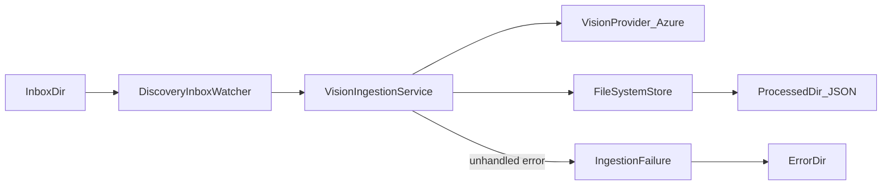

## Vision Ingestion Worker

The `@asymmetric-legal/vision-worker` watches a discovery **inbox** directory for new files, sends each document to a configured vision provider (Azure Form Recognizer by default), and writes structured `VisionOutput` records to a **processed** directory. If ingestion fails, the original file is moved to an **error** directory for follow‑up.

---

## Operator Guide

### Required configuration

#### Azure Form Recognizer environment variables

These variables control the Azure Form Recognizer integration wired up in `src/main.ts` via `createAzureVisionProvider`.

- **`AZURE_FORM_RECOGNIZER_ENDPOINT` (required)**  
  - Full endpoint URL for the Form Recognizer resource.  
  - If this or the API key is missing, the worker throws during startup.

- **`AZURE_FORM_RECOGNIZER_API_KEY` (required)**  
  - API key for the Form Recognizer resource.  
  - Required alongside the endpoint; both are validated together.

- **`AZURE_FORM_RECOGNIZER_MODEL_ID` (optional, default: `prebuilt-document`)**  
  - Model ID passed into `beginAnalyzeDocument`.  
  - Override this if you have a custom model; otherwise the `prebuilt-document` model is used.

- **`LOG_LEVEL` (optional, default: `info`)**  
  - Controls verbosity of the JSON logs emitted via `createConsoleLogger`.  
  - Set to `debug` during development to see more detailed events.

#### Discovery directory environment variables

The worker uses `loadDiscoveryConfig` from `src/discoveryConfig.ts` to determine where to watch for files and where to write outputs:

- **`DISCOVERY_INBOX_DIR`**  
  - Directory watched for new discovery documents.  
  - **Default**: `<cwd>/discovery/inbox`.

- **`DISCOVERY_PROCESSED_DIR`**  
  - Directory where successful ingestions are written as JSON envelopes.  
  - **Default**: `<cwd>/discovery/processed`.

- **`DISCOVERY_ERROR_DIR`**  
  - Directory where files are moved if ingestion fails.  
  - **Default**: `<cwd>/discovery/error`.

On startup, `src/main.ts` ensures all three directories exist:

- `inboxDir`
- `processedDir`
- `errorDir`

using `fs.mkdir(..., { recursive: true })`.

**Example layout** when running from the repo root, with defaults:

```text
discovery/
  inbox/
    KRAFT-123.pdf
  processed/
    KRAFT-123.json
  error/
    CORRUPT-001.pdf
```

---

## BatesID naming convention

The worker derives a strongly-typed `BatesID` (from `@asymmetric-legal/types`) from each filename using `src/batesIdFromFilename.ts`.

### Regex and derivation logic

1. The worker takes the **basename** of the file (e.g. `KRAFT-123.pdf` → `KRAFT-123.pdf`).  
2. It strips a single extension (e.g. `KRAFT-123.pdf` → `KRAFT-123`).  
3. It validates the remaining name against:

```text
^[A-Z0-9]+-[0-9]+$
```

Spelled out:

- One or more **uppercase letters or digits** (`[A-Z0-9]+`),
- followed by a **single hyphen** (`-`),
- followed by one or more **digits** (`[0-9]+`).

Only filenames whose basename (without extension) matches this pattern are accepted and cast to the branded `BatesID` type.

### Examples

- **Accepted**
  - `KRAFT-123.pdf` → `KRAFT-123` (`BatesID`)
  - `ABC123-0001.tif` → `ABC123-0001` (`BatesID`)

- **Rejected**
  - `KRAFT123.pdf` (missing hyphen)
  - `123-KRAFT.pdf` (suffix is not purely numeric)
  - `kraft-123.pdf` (lowercase prefix; the regex requires uppercase A–Z)

When a filename does **not** match the pattern, `batesIdFromFilename` throws an error that includes the invalid name and the expected pattern. This causes ingestion to fail for that file and, as described below, the watcher will move the original file into the error directory.

---

## Inbox → Processed → Error lifecycle

### High-level flow

At a high level, the ingestion pipeline is:

1. **DiscoveryInboxWatcher** (`src/DiscoveryInboxWatcher.ts`) watches the `inboxDir` for new files.  
2. For each new file, it calls **VisionIngestionService** (`src/VisionIngestionService.ts`) to perform ingestion.  
3. **VisionIngestionService**:
   - Derives a `BatesID` from the filename.
   - Generates `TraceID` and `SpanID` for observability.
   - Reads the file into a `Buffer`.
   - Calls the configured **VisionProvider** (Azure Form Recognizer by default) to obtain a `VisionOutput`.
   - Wraps the `VisionOutput` and metadata in a `VisionIngestionRecord`.
   - Persists that record using **FileSystemStore** (`src/FileSystemStore.ts`) into the `processedDir` as JSON.
4. If ingestion ultimately fails, **DiscoveryInboxWatcher** moves the original file from `inboxDir` to `errorDir`.

### Component responsibilities

- **`DiscoveryInboxWatcher`**
  - Uses `chokidar` to watch `inboxDir` for new files.
  - For each added file:
    - Logs a structured event including `filePath` and its path relative to the inbox.
    - Calls `VisionIngestionService.ingestFile(filePath)`.
  - If ingestion fails:
    - Logs the failure.
    - Ensures `errorDir` exists.
    - Moves the file from `inboxDir` to `errorDir` (same basename).
    - Logs success or failure of the move.

- **`VisionIngestionService`**
  - Derives `batesId` via `batesIdFromFilename(filePath)`.
  - Generates `traceId` and `spanId` using shared utilities.
  - Uses `withExponentialBackoff` (with shared `AsyncBackoffSettings`) to:
    - Read the file contents into a `Buffer`.
    - Call `visionProvider.analyzeDocument(batesId, buffer, traceId, spanId)` to produce a `VisionOutput`.
    - Build a `VisionIngestionRecord` with:
      - `vision` (the `VisionOutput`),
      - `traceId`, `spanId`,
      - `sourcePath` (original file path),
      - `ingestedAtIso` (ISO-8601 timestamp).
    - Persist via `fileSystemStore.saveVisionResult(record)`.

- **`FileSystemStore`**
  - Writes each `VisionIngestionRecord` as pretty-printed JSON to:
    - `<processedDir>/<BATES_ID>.json`.
  - Logs a structured event containing the `batesId` and `outputPath`.

- **`VisionProvider` (Azure by default)**
  - Implemented by `AzureVisionProvider` in `src/providers/AzureVisionProvider.ts`.
  - Uses `@azure/ai-form-recognizer` to analyze documents and convert them into:
    - A `VisionOutput` (`batesId`, `fullText`, `fragments`).
    - Each fragment includes text, page number, bounding box, and confidence score.

### Lifecycle diagram



In normal operation, files flow **Inbox → Processed**, with one JSON envelope per document. When ingestion encounters unrecoverable errors (invalid BatesID, provider failure, filesystem errors during persistence), the file instead flows **Inbox → Error** for manual investigation.

---

## Running the worker

From the repository root (using your workspace package manager), you can:

- **Install dependencies** (example with `pnpm`):

```bash
pnpm install
```

- **Run the worker in development mode** (TypeScript, with source maps):

```bash
pnpm --filter @asymmetric-legal/vision-worker dev
```

- **Build and run the compiled worker**:

```bash
pnpm --filter @asymmetric-legal/vision-worker build
pnpm --filter @asymmetric-legal/vision-worker start
```

Ensure the Azure and discovery directory environment variables described above are set before starting the worker. Logs are emitted as newline-delimited JSON to stdout and can be shipped to your logging backend or inspected locally with tools like `jq`.

